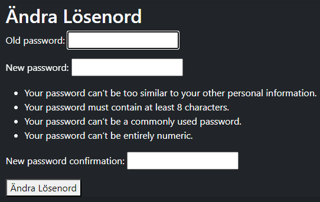
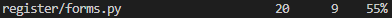

# Testing

In this section, I will demonstrate the rigorous testing conducted to ensure the functionality, compatibility, and responsiveness of the project.

Code Validation

# HTML
All HTML files were validated using the W3C HTML Validator.

# CSS
CSS files were validated using the W3C CSS Validator.

# Python
Python files were validated using the PEP8 CI Python Linter.

# Browser Compatibility
The project was tested on multiple browsers to ensure compatibility.

# Responsiveness
The project was tested on various devices to confirm responsiveness.

# Lighthouse Audit
A Lighthouse Audit was performed to evaluate the project's performance.

# Defensive Programming
Manual testing was conducted to verify defensive programming measures.

# User Story Testing
User stories were tested to ensure they were effectively implemented.

# Automated Testing
Unit tests were executed to validate the functionality of the application.

# GitHub Issues
All fixed and unresolved bugs were tracked via GitHub Issues

## Code Validation

### HTML

I have used the recommended [HTML W3C Validator](https://validator.w3.org) to validate all of my HTML files.

| Page | W3C URL | Screenshot | Notes |
| --- | --- | --- | --- |
| Home | [W3C](https://validator.w3.org/nu/?doc=https%3A%2F%2Fmirusnordic-f36ddbc9881a.herokuapp.com%2F) |  | Pass: No Errors  |
| Treatments | [W3C](https://validator.w3.org/nu/?doc=https%3A%2F%2Fmirusnordic-f36ddbc9881a.herokuapp.com%2Ftreatments%2Ftreatments%2F) |  | Pass: No Errors |
| Login | [W3C](https://validator.w3.org/nu/?doc=https%3A%2F%2Fmirusnordic-f36ddbc9881a.herokuapp.com%2Faccounts%2Flogin%2F) |  | Pass: No Errors |
| Dashboard | [W3C](https://validator.w3.org/nu/?doc=https%3A%2F%2Fmirusnordic-f36ddbc9881a.herokuapp.com%2Fdashboard%2F) |  | Pass: No Errors |
| Change password | [W3C](https://mirusnordic-f36ddbc9881a.herokuapp.com/dashboard/change_email/) |  | Pass: No Errors |
| Change Email | [W3C](https://mirusnordic-f36ddbc9881a.herokuapp.com/dashboard/change_email/) |  | Pass: No Errors |
| Sign up | [W3C](https://validator.w3.org/nu/?doc=https%3A%2F%2Fmirusnordic-f36ddbc9881a.herokuapp.com%2Fregister%2F) |  | Pass: No Errors |

### CSS

I have used the recommended [CSS Jigsaw Validator](https://jigsaw.w3.org/css-validator) to validate all of my CSS files.

### Python

I have used the recommended [PEP8 CI Python Linter](https://pep8ci.herokuapp.com) to validate all of my Python files.

| File | Screenshot | Notes |
| --- | --- | --- |
| home views.py |  | all clear, no errors found |
| home urls.py |  | all clear, no errors found |
| treatments views.py|  | all clear, no errors found |
| treatments urls.py|  | all clear, no errors found |
| treatments models.py|  | E501 line to long |
| treatments forms.py|  | all clear, no errors found |
| register urls.py|  | all clear, no errors found |
| register view.py|  | all clear, no errors found |
| register forms.py|  | all clear, no errors found |
| Dashboard forms.py|  | all clear, no errors found |
| Dashboard urls.py|  | all clear, no errors found |
| Dashboard views.py|  | W393 W292 |
| Main urls.py|  | all clear, no errors found |
| Main views.py|  | all clear, no errors found |
| Main settings.py|  | all clear, no errors found |

## Browser Compatibility

I've tested my deployed project on multiple browsers to check for compatibility issues.

| Browser | Home | treatments | login | dashboard | change Email | change Password | Notes |
| --- | --- | --- | --- | --- | --- | --- | --- | -- |
| Chrome |  |  |  |  |  | Works as expected |
| Edge |  |  |  |  |  |  | Works as expected |
| Safari |   |  |  |  |  |  | Minor CSS differences |

## Responsiveness

I've tested my deployed project on multiple devices using [ResponsiveViewer] and [GoFullPage] to check for responsiveness issues.

devices tested are: 
- (iPhone 8 Plus, 7 Plus, 6S Plus 413x736).
- (Galaxy S9, Note 8, S8 360x760).
- (iPad 768x1024) 
- (Nexus 10 800x1280)
- (iPad Pro 834x1112)
- (Laptop 3 1280x950)
- (iPhone XR, XS Max 414x896)
- (iPhone 8, 7, 6S, 6 375x667)
- (iPad Mini 768x1024)
- (Laptop 1 1440x900)

| page | Notes |
| --- | --- | --- |
| Home |  | Works as expected |
| Treatments |  | Works as expected |
| Dashsboard |  | Works as expected |
| Login |  | Works as expected |
| Register |  | Works as expected |
| Change Email |  | Works as expected |
| Change Password |  | Works as expected |

## Lighthouse Audit

I've tested my deployed project using the Lighthouse Audit tool to check for any major issues.

| Page | Mobile | Desktop | Notes |
| --- | --- | --- | --- |
| Home |  |  | complaints about large images |
| Treatments |  |  | No issues |
| Log in |  |  | No issues |
| register |  |  | No issues |
| Dashboard |  |  | No issues |
| Change Email |  |  | No issues |
| Change Password |  |  | No issues |

## Defensive Programming

Defensive programming was manually tested with the below user acceptance testing:

| Page | Expectation | Test | Result | Fix | Screenshot |
| --- | --- | --- | --- | --- | --- |
| Home | | | | | |
| | Users cannot submit an empty form | Trying to submit empty | The feature behaved as expected, and it did not accept | Test concluded and passed |  |
| change Password| | | | | |
| | requirements are filled | writeing incorrect password | The feature behaved as expected, and it did not accept | Test concluded and passed |  |
| Treatments | | | | | |
| | requierd login to book a treatment | forsing url and pressing button when not logged in | The feature behaved as expected, and redirected me to log in page | Test concluded and passed |  |

## User Story Testing

| User Story | Screenshot |
| --- | --- |
| As a new site user, I would like to create an acoount |  |
| As a new site user, I would like to view treatment options, so that I can chose what i need. |  |
| As a new site user, I would like to book treatment option. |  |
| As a returning site user, I would like to Edit my email, if i want to change my email |  |
| As a returning site user, I would like to edit my password. |  |
| As a returning site user, I would like to Cancel booking if i need to. |  |
| As a returning site user, I would like to Log in, so that I can see my bookings|  |

## Automated Testing

I have conducted a series of automated tests on my application.

I fully acknowledge and understand that, in a real-world scenario, an extensive set of additional tests would be more comprehensive.S

### Python (Unit Testing)

I have used Django's built-in unit testing framework to test the application functionality.

In order to run the tests, I ran the following command in the terminal each time:

`python3 manage.py test name-of-app `

To create the coverage report, I would then run the following commands:

`coverage run --source=name-of-app manage.py test`

`coverage report`

To see the HTML version of the reports, and find out whether some pieces of code were missing, I ran the following commands:

`coverage html`

`python3 -m http.server`

Below are the results from the various apps on my application that I've tested:

| App | File | Coverage | Screenshot |
| --- | --- | --- | --- |
| home | test_urls.py | 100% |  |
| home | test_views.py | 40% |  |
| home | test_models.py.py | 100% |  |
| treatments | test_forms.py | 40% |  |
| treatments | test_models.py |  90% |  |
| treatments | test_urls.py | 100% |  |
| treatments | test_views.py | 38% |  |
| register | test_forms.py | 100% |  |
| register | test_models.py | 89% |  |
| register | test_urls.py | 100% |  |
| register | test_views.py | 21% |  |
| dashboard | test_forms.py | 100% |  |
| dashboard | test_models.py | 100% |  |
| dashboard | test_urls.py | 100% |  |
| dashboard | test_views.py | 34% |  |
| main | test_urls.py | 100% |  |
| main | test_views.py | 60% |  |

### GitHub **Issues**

**Fixed Bugs**

All previously closed/fixed bugs can be tracked [here](https://github.com/jesperba01/mirusnordic_pp4/issues?q=is%3Aissue+is%3Aclosed).

| Bug | Status |
| --- | --- |
| [Form.py dont show up on login page](https://github.com/jesperba01/mirusnordic_pp4/issues/15) | Closed |
| [Site is Being pushed to the right](https://github.com/jesperba01/mirusnordic_pp4/issues/14) | Closed |
| [Url Directions for Chnage Email](https://github.com/jesperba01/mirusnordic_pp4/issues/13) | Closed |

## Unfixed Bugs

There are no remaining bugs that I am aware of.